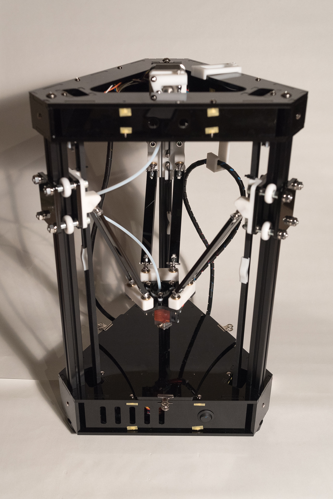

# KoratDelta
Korat Delta is one of the 3D Printer using Delta kinematics.
Almost all parts is made by using the Laser cutting machine and the 3D Printer.
You can make this one at Maker Spaces like FabLab.

## 3D Printed Parts
[Thingiverse](https://www.thingiverse.com/thing:1629355)
